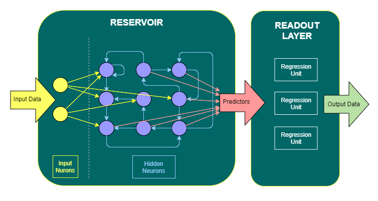

# Reservoir Computing for .NET (RCNet)

 
The aim of this project is to make the [reservoir computing](https://en.wikipedia.org/wiki/Reservoir_computing) methods  easy to use and available for .net platform without any other dependencies.
Two main reservoir computing methods are called Echo State Network (ESN) and Liquid State Machine (LSM).
RCNet supports both of these methods. Moreover, since ESN and LSM are based on similar general principles, RCNet allows to design complex "hybrid" recurrent reservoirs consisting of spiking and analog neurons synaptically linked together.
Mutual cooperation of the hidden neurons having stateless analog and stateful spiking activation functions is enabled by specific implementation of hidden neuron. Hidden neuron is not stateless and it can fire spikes even in case of stateless analog activation is used. "Analog spikes" are based on defined firing event depending on current and previous values of the stateles activation.
Hidden neuron also provides a standardized set of available predictors no matter what activation function is used. According to preliminary results, it seems that it is no longer true that ESN is not capable to generalize and separate input signal enaugh to perform excellent classification. On the contrary. It now appears that the use of pure analog activations (like TanH) and the simple classical ESN reservoir design could be a capable competitor to spiking LSM reservoirs.
 
The main component of RCNet is called "**State Machine**" and it has to be instantiated through its settings class. "**State Machine**" is serializable so it is easily possible to instantiate and train it and than use it as a real-time loadable component in the solution.
 
More detailed documentation will be posted [here](https://github.com/okozelsk/NET/wiki) as soon as the current stage of the wild changes is over.
 
*I welcome questions, ideas and suggestions for improvements, usage experiences, bug alerts, constructive comments, etc... Please use my email address oldrich.kozelsky@email.cz to contact me.*

## State Machine demo application (.NET Core 3.1)
Main functionality and possibilities of the State Machine are demonstrated in a simple [demo application](https://github.com/okozelsk/NET/tree/master/Demo/DemoConsoleApp).
Application has no startup parameters and when started, it shows the menu.
 
Note that if necessary, examples use Examples sub-folder relative to the location of the executable DemoConsoleApp.exe.

### Demonstration of performance and configuration options (1. menu choice)
Application performs sequence of tasks defined in the [SMDemoSettings.xml](./Demo/DemoConsoleApp/SMDemoSettings.xml) xml file, where each task is defined in the xml element "case" so you can easily insert new task or tune existing one by simple modification of xml content.
SMDemoSettings.xml has to be located in the same folder as the executable DemoConsoleApp.exe.

#### Notes for SMDemoSettings.xml modification
If you modify SMDemoSettings.xml within the open solution in MS Studio, then for the correct connection of xml and xsd it is enough to have SMDemoSettings.xsd and RCNetTypes.xsd open at the same time. If you modify SMDemoSettings.xsd outside the open solution, then you must first add the schemaLocation = "RCNetTypes.xsd" attribute to the "import" element in the SMDemoSettings.xsd schema in the destination directory where the DemoConsoleApp.exe executable is located.
Demo application has internally implemented the xml validation so connection of xml and xsd directly on file level is not necessary. But functional external connection of xml and xsd is useful for manual modifications, because consistency checks, annotations, selections from allowed values and checks of the range of entered values are then available instantly.

#### Time-series classification results comparison
SMDemoSettings.xml currently includes several classification problems from the:
[Anthony Bagnall, Jason Lines, William Vickers and Eamonn Keogh, The UEA & UCR Time Series Classification Repository, www.timeseriesclassification.com](https://timeseriesclassification.com)
site and State Machine is surprisingly able to achieve competetive results to the best classification algorithms referenced on that website.
 

|Dataset|State Machine Accuracy|Best Ref. Accuracy|Best Ref. Algorithm|
|--|--|--|--|
|[CricketX](https://timeseriesclassification.com/description.php?Dataset=CricketX)|82.05%|81.4%|COTE|
|[Worms](https://timeseriesclassification.com/description.php?Dataset=Worms)|83.12%|73.49%|BOSS|
|[BeetleFly](https://timeseriesclassification.com/description.php?Dataset=BeetleFly)|100%|94.85%|BOSS|
|[BirdChicken](https://timeseriesclassification.com/description.php?Dataset=BirdChicken)|100%|98.4%|BOSS|
|[ProximalPhalanx](https://timeseriesclassification.com/description.php?Dataset=ProximalPhalanxOutlineAgeGroup)|87.8%|88.09%|ST|
|[Yoga](https://timeseriesclassification.com/description.php?Dataset=Yoga)|91.27%|90.99%|BOSS|
|[Libras](https://timeseriesclassification.com/description.php?Dataset=Libras)|92.78%|89.4%|DTWi|

### Code examples (2. menu choice)
This very simple machine learning example shows how to learn Feed Forward Network component to solve boolean algebra. Feed Forward network is a part of the State Machine's readout layer, but here is shown that it can be also used as a stand alone component.

### Code examples (3. menu choice)
Example shows how to manually setup State Machine configuration from the scratch, then how to train State Machine and how to verify its performance.

### Code examples (4, ... menu choices)
Several examples show usage of the State Machine Designer component to setup simple State Machine configuration, then how to train State Machine and how to verify its performance.

### Data format for the demo application
Input data is standardly located in the Data sub-folder relative to the location of the executable DemoConsoleApp.exe. Data is expected in csv format and data delimiter can be a tab, semicolon or comma character.
* **Continuous feeding regime** requires a standard csv format, where the first line contains the names of the data fields and each next line contains the data. [Here](./Demo/DemoConsoleApp/Data/TTOO.csv) is an example
* **Patterned feeding regime** requires specific logical csv format without colum names (header). Each data line contains values of steady (optional) and repetitive pattern features followed by expected output values at the end. Values of repetitive pattern features can be organized in two ways: groupped [v1(t1),v2(t1),v1(t2),v2(t2),v1(t3),v2(t3)] or sequential [v1(t1),v1(t2),v1(t3),v2(t1),v2(t2),v2(t3)]. [Here](./Demo/DemoConsoleApp/Data/LibrasMovement_train.csv) is an example

## RCNet library (.NET Standard 2.0) Components overview

 
(listed in logical order from basic to composite and complex)

### Math
|Component|Description|
|--|--|
|[BasicStat](./RCNet/MathTools/BasicStat.cs)|Provides basic statistics of given data (averages, sum of squares, standard deviation, etc.)|
|[WeightedAvg](./RCNet/MathTools/WeightedAvg.cs)|Computes weighted average of given value/weight data pairs|
|[MovingDataWindow](./RCNet/MathTools/MovingDataWindow.cs)|Implements moving data window and offers computation of weighted average of recent part of given data|
|[ODENumSolver](./RCNet/MathTools/Differential/ODENumSolver.cs)|Implements ordinary differential equations (ODE) numerical solver supporting Euler and RK4 methods|
|[Vector](./RCNet/MathTools/VectorMath/Vector.cs)|Implements vector of double values supporting basic mathematical operations|
|[Matrix](./RCNet/MathTools/MatrixMath/Matrix.cs)|Implements matrix of double values supporting basic mathematical operations. Contains buit-in Power Iteration method for the largest eigen value quick estimation|
|[EVD](./RCNet/MathTools/MatrixMath/EVD.cs)|Full eigen values and vectors decomposition of a squared matrix|
|[SVD](./RCNet/MathTools/MatrixMath/SVD.cs)|Singular values decomposition of a matrix|
|[QRD](./RCNet/MathTools/MatrixMath/QRD.cs)|QR decomposition of a matrix|
|[LUD](./RCNet/MathTools/MatrixMath/LUD.cs)|LU decomposition of a squared matrix|
|[ParamSeeker](./RCNet/MathTools/PS/ParamSeeker.cs)|Implements an error driven iterative search for the best value of a given parameter|
|[HurstExpEstim](./RCNet/MathTools/Hurst/HurstExpEstim.cs)|Implements Hurst exponent estimator and Rescalled range. It can be used to evaluate level of data randomness|
|["RandomValue"](https://github.com/okozelsk/NET/tree/master/RCNet/RandomValue)|Supports Uniform, Gaussian, Exponential and Gamma distributions. Here is [extension code](./RCNet/Extensions/RandomExtensions.cs)|
|[Others](https://github.com/okozelsk/NET/tree/master/RCNet/MathTools)|Set of small additional helper components like PhysUnit, Interval, Bitwise, Combinatorics, Discrete,...|

### XML handling
|Component|Description|
|--|--|
|[DocValidator](./RCNet/XmlTools/DocValidator.cs)|Helper class for xml document loading and validation|

### Data generators
|Component|Description|
|--|--|
|[PulseGenerator](./RCNet/Neural/Data/Generators/PulseGenerator.cs)|Generates constant pulses having specified average period. Pulse leaks follow specified random distribution or can be constant|
|[MackeyGlassGenerator](./RCNet/Neural/Data/Generators/MackeyGlassGenerator.cs)|Generates Mackey-Glass chaotic signal|
|[RandomGenerator](./RCNet/Neural/Data/Generators/RandomGenerator.cs)|Generates random signal following specified distribution|
|[SinusoidalGenerator](./RCNet/Neural/Data/Generators/SinusoidalGenerator.cs)|Generates sinusoidal signal|

### Data Filtering
|Component|Description|
|--|--|
|[BinFeatureFilter](./RCNet/Neural/Data/Filter/BinFeatureFilter.cs)|Binary (0/1) feature filter|
|[EnumFeatureFilter](./RCNet/Neural/Data/Filter/EnumFeatureFIlter.cs)|Enumeration (1..N) feature filter|
|[RealFeatureFilter](./RCNet/Neural/Data/Filter/RealFeatureFilter.cs)|Real number feature filter supporting standardization and range reserve for handling of unseen data in the future|

### Chainable Data Transformations
|Component|Description|
|--|--|
|[CDivTransformer](./RCNet/Neural/Data/Transformers/CDivTransformer.cs)|Provides "constant divided by an input field value" transformation|
|[DiffTransformer](./RCNet/Neural/Data/Transformers/DiffTransformer.cs)|Transforms input field value as a difference between current value and a past value|
|[DivTransformer](./RCNet/Neural/Data/Transformers/DivTransformer.cs)|Divides the value of the first input field by the value of the second input field|
|[ExpTransformer](./RCNet/Neural/Data/Transformers/ExpTransformer.cs)|Specified base powered by an input field value|
|[LinearTransformer](./RCNet/Neural/Data/Transformers/LinearTransformer.cs)|Two input fields linear transformation (a*X + b*Y)|
|[LogTransformer](./RCNet/Neural/Data/Transformers/LogTransformer.cs)|Transforms input field value to its logarithm of specified base|
|[MulTransformer](./RCNet/Neural/Data/Transformers/MulTransformer.cs)|Multiplies the value of the first input field by the value of the second input field|
|[MWStatTransformer](./RCNet/Neural/Data/Transformers/MWStatTransformer.cs)|Keeps stat of input field recent values and provides statistical features as a transformed values (Sum, NegSum, PosSum, SumOfSquares, Min, Max, Mid, Span, ArithAvg, MeanSquare, RootMeanSquare, Variance, StdDev, SpanDev)|
|[PowerTransformer](./RCNet/Neural/Data/Transformers/PowerTransformer.cs)|Transforms input field value to value^exponent|
|[YeoJohnsonTransformer](./RCNet/Neural/Data/Transformers/YeoJohnsonTransformer.cs)|Applies Yeo-Johnson transformation to input field value. See the [wiki pages](https://en.wikipedia.org/wiki/Power_transform#Yeo%E2%80%93Johnson_transformation).|

### Analog to spikes data coding
|Component|Description|
|--|--|
|[A2SCoderSignalStrength](./RCNet/Neural/Data/Coders/AnalogToSpiking/A2SCoderSignalStrength.cs)|Implements signal strength coder meeting two important spike-train conditions together: 1. Frequency - as stronger value as higher spiking frequency. 2. Time to first spike - as stronger value as earlier spike.|
|[A2SCoderGaussianReceptors](./RCNet/Neural/Data/Coders/AnalogToSpiking/A2SCoderGaussianReceptors.cs)|Implements Gussian Receptive Fields coder.|
|[A2SCoderUpDirArrows](./RCNet/Neural/Data/Coders/AnalogToSpiking/A2SCoderUpDirArrows.cs)|Implements a signal direction receptor, sensitive to upward direction against a historical value at time T-1..number of receptors.|
|[A2SCoderDownDirArrows](./RCNet/Neural/Data/Coders/AnalogToSpiking/A2SCoderDownDirArrows.cs)|Implements a signal direction receptor, sensitive to downward direction against a historical value at time T-1..number of receptors.|

### Data holding
|Component|Description|
|--|--|
|[SimpleQueue](./RCNet/Queue/SimpleQueue.cs)|Implements quick and simple FIFO queue (template). Supports access to enqueued elements so it can be also used as the "sliding window"|
|[DelimitedStringValues](./RCNet/CsvTools/DelimitedStringValues.cs)|Helper encoder and decoder of data line in csv format|
|[CsvDataHolder](./RCNet/CsvTools/CsvDataHolder.cs)|Provides simple loading and saving of csv data|
|[VectorBundle](./RCNet/Neural/Data/VectorBundle.cs)|Bundle of input data vectors and corresponding desired output vectors (1:1). Supports upload from csv file|
|[InputPattern](./RCNet/Neural/Data/InputPattern.cs)|Input pattern supporting signal detection, unification and resampling features|
|[ResultBundle](./RCNet/Neural/Data/ResultBundle.cs)|Bundle of input, computed and desired output vectors (1:1:1)|

### Analog activation functions (stateless)
See the [wiki pages.](https://en.wikipedia.org/wiki/Activation_function)

|Component|Description|
|--|--|
|[BentIdentity](./RCNet/Neural/Activation/BentIdentity.cs)|Bent identity activation function|
|[SQNL](./RCNet/Neural/Activation/SQNL.cs)|Square nonlinearity activation function|
|[Elliot](./RCNet/Neural/Activation/Elliot.cs)|Elliot activation function (aka Softsign)|
|[Gaussian](./RCNet/Neural/Activation/Gaussian.cs)|Gaussian activation function|
|[Identity](./RCNet/Neural/Activation/Identity.cs)|Identity activation function (aka Linear)|
|[ISRU](./RCNet/Neural/Activation/ISRU.cs)|ISRU (Inverse Square Root Unit) activation function|
|[LeakyReLU](./RCNet/Neural/Activation/LeakyReLU.cs)|Leaky ReLU (Leaky Rectified Linear Unit) activation function|
|[Sigmoid](./RCNet/Neural/Activation/Sinusoid.cs)|Sigmoid activation function|
|[Sinc](./RCNet/Neural/Activation/Sinc.cs)|Sinc activation function|
|[Sinusoid](./RCNet/Neural/Activation/Sinusoid.cs)|Sinusoid activation function|
|[SoftExponential](./RCNet/Neural/Activation/SoftExponential.cs)|Soft exponential activation function|
|[SoftPlus](./RCNet/Neural/Activation/SoftPlus.cs)|Soft Plus activation function|
|[TanH](./RCNet/Neural/Activation/TanH.cs)|TanH activation function|

### Spiking activation functions (stateful)
See the [wiki pages.](https://en.wikipedia.org/wiki/Biological_neuron_model)

|Component|Description|
|--|--|
|[SimpleIF](./RCNet/Neural/Activation/SimpleIF.cs)|Simple Integrate and Fire activation function|
|[LeakyIF](./RCNet/Neural/Activation/LeakyIF.cs)|Leaky Integrate and Fire activation function|
|[ExpIF](./RCNet/Neural/Activation/ExpIF.cs)|Exponential Integrate and Fire activation function|
|[AdExpIF](./RCNet/Neural/Activation/AdExpIF.cs)|Adaptive Exponential Integrate and Fire activation function|
|[IzhikevichIF](./RCNet/Neural/Activation/IzhikevichIF.cs)|Izhikevich Integrate and Fire activation function (model "one fits all")|

### Non-recurrent networks and trainers
|Component|Description|
|--|--|
|[FeedForwardNetwork](./RCNet/Neural/Network/NonRecurrent/FF/FeedForwardNetwork.cs)|Implements the feed forward network supporting multiple hidden layers|
|[RPropTrainer](./RCNet/Neural/Network/NonRecurrent/FF/RPropTrainer.cs)|Resilient propagation (iRPROP+) trainer of the feed forward network|
|[QRDRegrTrainer](./RCNet/Neural/Network/NonRecurrent/FF/QRDRegrTrainer.cs)|Implements the linear regression (QR decomposition) trainer of the feed forward network. This is the special case trainer for FF network having no hidden layers and Identity output activation function|
|[RidgeRegrTrainer](./RCNet/Neural/Network/NonRecurrent/FF/RidgeRegrTrainer.cs)|Implements the ridge linear regression trainer of the feed forward network. This is the special case trainer for FF network having no hidden layers and Identity output activation function|
|[ElasticRegrTrainer](./RCNet/Neural/Network/NonRecurrent/FF/ElasticRegrTrainer.cs)|Implements the elastic net trainer of the feed forward network. This is the special case trainer for FF network having no hidden layers and Identity output activation function|
|||
|[ParallelPerceptron](./RCNet/Neural/Network/NonRecurrent/PP/ParallelPerceptron.cs)|Implements the parallel perceptron network|
|[PDeltaRuleTrainer](./RCNet/Neural/Network/NonRecurrent/PP/PDeltaRuleTrainer.cs)|P-Delta rule trainer of the parallel perceptron network|
|||
|[TrainedNetwork](./RCNet/Neural/Network/NonRecurrent/TrainedNetwork.cs)|Encapsulates trained non-recurrent (Feed forward or Parallel perceptron) network and related error statistics.|
|[TrainedNetworkBuilder](./RCNet/Neural/Network/NonRecurrent/TrainedNetworkBuilder.cs)|Builds single trained (Feed forward or Parallel perceptron) network. Performs training epochs and offers control to user to evaluate the network.|
|[TrainedNetworkCluster](./RCNet/Neural/Network/NonRecurrent/TrainedNetworkCluster.cs)|Encapsulates set of trained non-recurrent networks (cluster of TrainedNetwork instances) and related error statistics. Offers sub-predictions of inner member networks, weighted prediction and also prediction of the 2nd level network.|
|[TrainedNetworkClusterBuilder](./RCNet/Neural/Network/NonRecurrent/TrainedNetworkClusterBuilder.cs)|Builds cluster of trained networks based on x-fold cross validation approach. Each fold can have associated number of various networks.|

### State Machine Sub-Components
|Component|Description|
|--|--|
|[InputEncoder](./RCNet/Neural/Network/SM/Preprocessing/Input/InputEncoder.cs)|Processes given natural external input data and provides it's representation on analog and spiking input neurons for the data processing in the reservoirs. Supports set of various realtime input chainable data transformations and data generators as additional computed input fields. Supports two main input feeding regimes: Continuous (one input is a variables data vector at time T) and Patterned (one input is an InputPattern containing variables data for all timepoints). Supports three ways how to encode analog input value as the spikes: Horizontal (fast - simultaneous spiking activity of the large neuronal population), Vertical (slow - spike-train on single input neuron) or Forbidden (fast - spiking represetantion is then forbidden and analog values are directly used instead).|
|[AnalogInputNeuron](./RCNet/Neural/Network/SM/Preprocessing/Neuron/AnalogInputNeuron.cs)|Input neuron providing analog signal.|
|[SpikingInputNeuron](./RCNet/Neural/Network/SM/Preprocessing/Neuron/AnalogInputNeuron.cs)|Input neuron providing spiking signal.|
|[HiddenNeuron](./RCNet/Neural/Network/SM/Preprocessing/Neuron/HiddenNeuron.cs)|Supports both analog and spiking activation functions and can produce analog signal and/or spikes (neuron is able to fire spikes even when stateless analog activation is used). Supports Retainment property of analog activation (leaky integrator). Offers set of various predictors.|
|[Synapse](./RCNet/Neural/Network/SM/Preprocessing/Reservoir/Synapse/Synapse.cs)|Computes dynamically weighted signal from source to target neuron. It supports signal delaying and short-term plasticity supporting Constant, Linear and non-Linear Facilitation x Depression dynamics models.|
|[ReservoirInstance](./RCNet/Neural/Network/SM/Preprocessing/Reservoir/ReservoirInstance.cs)|Provides recurrent network supporting analog and spiking neurons working directly together. Supports SpectralRadius (for weights of analog neurons), Homogenous excitability of spiking neurons, Multiple 3D pools of neurons, Pool to pool connections. It can work as the Echo State Network reservoir, Liquid State Machine reservoir or Mixed reservoir|
|[NeuralPreprocessor](./RCNet/Neural/Network/SM/Preprocessing/NeuralPreprocessor.cs)|Encaptulates InputEncoder and reservoirs. Provides encaptulated data preprocessing to predictors for the readout layer|
|[ReadoutUnit](./RCNet/Neural/Network/SM/Readout/ReadoutUnit.cs)|Readout unit does the Forecast or Classification and encapsulates TrainedNetworkCluster.|
|[ReadoutLayer](./RCNet/Neural/Network/SM/Readout/ReadoutLayer.cs)|Implements independent readout layer consisting of trained readout units.|

### State Machine Component
The main component [StateMachine](./RCNet/Neural/Network/SM/StateMachine.cs) encapsulates independent NeuralPreprocessor and ReadoutLayer components into the single component and adds support for routing specific predictors and input fields to the specific readout units. Allows to bypass NeuralPreprocessor and to use input data directly as a predictors for the readout layer.

#### Setup
Each executive component that makes up StateMachine (including StateMachine itself) has its own related settings class providing configuration, which is required by the executive component's constructor.
 
Each settings class can be instantiated manually from scratch or from a xml element encapsulating all parameters. [RCNetTypes.xsd](./RCNet/RCNetTypes.xsd) defines all xml elements used in settings classes constructors.
 
Each settings class also implements the GetXml method so it can be instantiated from scratch and the initialization xml element can be exported by calling the GetXml method (and stored for later use). Using xml constructors is generally preferable because the initialization xml can be edited without the need to modify source code of the manual setup.
 
To make things easier, RCNet also implements helper component [StateMachineDesigner](./RCNet/Neural/Network/SM/StateMachineDesigner.cs) for easier setup of simple ESN and LSM StateMachine configurations from the code (see examples in demo application).