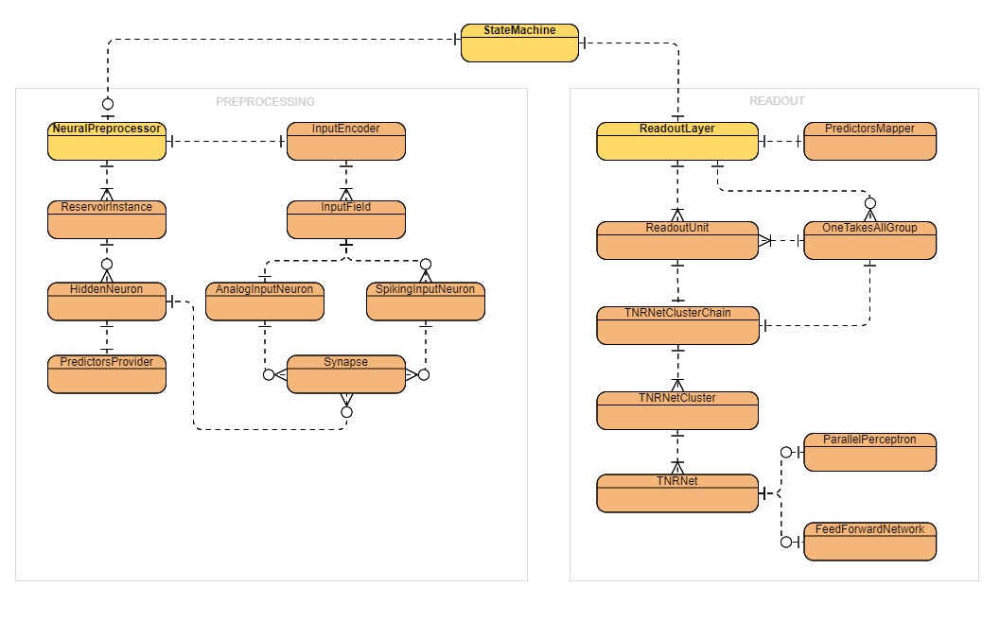

# Reservoir Computing for .NET (RCNet)

 
This repository offers a .NET machine learning library primarily focused on prediction and classification of time series.
RCNet library implementation is based on the ["**Reservoir Computing**"](https://en.wikipedia.org/wiki/Reservoir_computing) concept where the two most well-known methods are Echo State Network (ESN) and Liquid State Machine (LSM).
The main component of RCNet is called "**State Machine**". State Machine has quite wide configuration options of the reservoirs and except of both mentioned methods (ESN, LSM) it also supports "hybrid" recurrent reservoirs where hidden neurons having an analog and spiking activation can be synaptically connected.
The correct synaptic linkage of hidden neurons having heterogeneous activations is enabled by a specific implementation of a hidden neuron, where each hidden neuron provides analog and spiking output regardless of the type of activation function is used.
Dual output of hidden neuron also enables to always offer the full set of predictors on hidden neuron level (very important is the FiringTrace predictor).
Firing a spike of the hidden neuron having analog activation is based on defined firing event depending on current and previous value of the activation. Use of spiking based predictor (FiringTrace) dramatically improves classification accuracy of the classical ESN.
"Analog spiking" is an unique feature discovered and introduced by this project and thanks that, ESN is now capable to classify time series with high accuracy with relatively low resources and to be fully competetive to other classification algorithms.

## The demo application (.NET Core 3.1)
A simple [demo application](https://github.com/okozelsk/NET/tree/master/Demo/DemoConsoleApp) demonstrates main functionalities and possibilities of the State Machine component.
Application has no startup parameters and when started, it shows the menu.
 
*Note that application may write data into "Examples" sub-folder relative to the location of the executable DemoConsoleApp.exe.**

### Demonstration of performance and configuration options (1. menu choice)
Application performs sequence of tasks defined in the [SMDemoSettings.xml](./Demo/DemoConsoleApp/SMDemoSettings.xml) xml file, where each task is defined in the xml element "case" so you can easily insert new task or tune existing one by simple modification of xml content.
SMDemoSettings.xml has to be located in the same folder as the executable DemoConsoleApp.exe.

#### Notes for SMDemoSettings.xml modification
If you modify SMDemoSettings.xml within the open solution in MS Studio, then for the correct connection of xml and xsd it is enough to have SMDemoSettings.xsd and RCNetTypes.xsd open at the same time. If you modify SMDemoSettings.xsd outside the open solution, then you must first add the schemaLocation = "RCNetTypes.xsd" attribute to the "import" element in the SMDemoSettings.xsd schema in the destination directory where the DemoConsoleApp.exe executable is located.
Demo application has internally implemented the xml validation so connection of xml and xsd directly on file level is not necessary. But functional external connection of xml and xsd is useful for manual modifications, because consistency checks, annotations, selections from allowed values and checks of the range of entered values are then available instantly.

#### Time-series classification results comparison
SMDemoSettings.xml currently includes several classification problems from the:
[Anthony Bagnall, Jason Lines, William Vickers and Eamonn Keogh, The UEA & UCR Time Series Classification Repository, www.timeseriesclassification.com](https://timeseriesclassification.com)
site and State Machine is able to achieve competetive results to the best classification algorithms referenced on that website.
 

|Dataset|State Machine Accuracy|Best Ref. Accuracy|Best Ref. Algorithm|
|--|--|--|--|
|[CricketX](https://timeseriesclassification.com/description.php?Dataset=CricketX)|82.05%|81.4%|COTE|
|[Worms](https://timeseriesclassification.com/description.php?Dataset=Worms)|83.12%|73.49%|BOSS|
|[BeetleFly](https://timeseriesclassification.com/description.php?Dataset=BeetleFly)|100%|94.85%|BOSS|
|[BirdChicken](https://timeseriesclassification.com/description.php?Dataset=BirdChicken)|100%|98.4%|BOSS|
|[ProximalPhalanx](https://timeseriesclassification.com/description.php?Dataset=ProximalPhalanxOutlineAgeGroup)|87.8%|88.09%|ST|
|[Yoga](https://timeseriesclassification.com/description.php?Dataset=Yoga)|91.37%|90.99%|BOSS|
|[Libras](https://timeseriesclassification.com/description.php?Dataset=Libras)|92.78%|89.4%|DTWi|

### Code examples (2. menu choice)
This very simple machine learning example shows how to learn Feed Forward Network component to solve boolean algebra. Feed Forward network is a part of the State Machine's readout layer, but here is shown that it can be also used as a stand alone component.

### Code examples (3. menu choice)
Example shows how to setup State Machine configuration from the scratch in the code, then how to train State Machine and how to verify its performance.

### Code examples (4, ... menu choices)
Several examples show usage of the State Machine Designer component to setup simple State Machine configurations, then how to train State Machine and how to verify its performance.

### Data format for the demo application
Input data is standardly located in the "Data" sub-folder relative to the location of the executable DemoConsoleApp.exe. Data is expected in csv format and data delimiter can be a tab, semicolon or comma character.
* **Continuous feeding regime** requires a standard csv format, where the first line contains the names of the data fields and each next line contains the data. [Here](./Demo/DemoConsoleApp/Data/TTOO.csv) is an example
* **Patterned feeding regime** requires specific logical csv format without colum names (header). Each data line contains values of steady (optional) and repetitive pattern features followed by expected output values at the end. Values of repetitive pattern features can be organized in two ways: groupped [v1(t1),v2(t1),v1(t2),v2(t2),v1(t3),v2(t3)] or sequential [v1(t1),v1(t2),v1(t3),v2(t1),v2(t2),v2(t3)]. [Here](./Demo/DemoConsoleApp/Data/LibrasMovement_train.csv) is an example

## RCNet library (.NET Standard 2.0)

|Maintenance index|Cyclomatic complexity|Depth of inheritance|Code lines|Executable code lines|
|--|--|--|--|--|
|82 (green)|7482|3|53958|11949|

Components by category:

### Math
|Component|Description|
|--|--|
|[BasicStat](./RCNet/MathTools/BasicStat.cs)|Implements the basic statistics of sample data.|
|[WeightedAvg](./RCNet/MathTools/WeightedAvg.cs)|Implements the weighted average.|
|[MovingDataWindow](./RCNet/MathTools/MovingDataWindow.cs)|Implements the moving data window providing additional functions such as statistics, weighted average, etc.|
|[ODENumSolver](./RCNet/MathTools/Differential/ODENumSolver.cs)|Implements a simple numerical solver of the Ordinary Differential Equation(s).|
|[Vector](./RCNet/MathTools/VectorMath/Vector.cs)|Implements the vector.|
|[Matrix](./RCNet/MathTools/MatrixMath/Matrix.cs)|Implements the real matrix. It does not support the sparse matrix format.|
|[EVD](./RCNet/MathTools/MatrixMath/EVD.cs)|Implements the Eigenvalue decomposition of a square matrix.|
|[SVD](./RCNet/MathTools/MatrixMath/SVD.cs)|Implements the Singular Value decomposition of a matrix.|
|[QRD](./RCNet/MathTools/MatrixMath/QRD.cs)|Implements the QR decomposition of a matrix.|
|[LUD](./RCNet/MathTools/MatrixMath/LUD.cs)|Implements the LU (Lowed-Upper) decomposition of a square matrix.|
|[ParamValFinder](./RCNet/MathTools/ParamValFinder.cs)|Implements a simple iterative error-driven search for the parameter's optimal value.|
|[HurstExpEstim](./RCNet/MathTools/Hurst/HurstExpEstim.cs)|Implements the Hurst Exponent estimator using the rescaled range analysis.|
|["RandomValue"](https://github.com/okozelsk/NET/tree/master/RCNet/RandomValue)|Implements the random value. Supports Uniform, Gaussian, Exponential and Gamma distributions. Here is an [extension code](./RCNet/Extensions/RandomExtensions.cs)|
|[Others](https://github.com/okozelsk/NET/tree/master/RCNet/MathTools)|Set of small additional helper components like PhysUnit, Interval, Bitwise, Combinatorics, Discrete,...|

### XML handling
|Component|Description|
|--|--|
|[DocValidator](./RCNet/XmlTools/DocValidator.cs)|Implements the xml document loader and validator.|

### Data generators
|Component|Description|
|--|--|
|[PulseGenerator](./RCNet/Neural/Data/Generators/PulseGenerator.cs)|Implements the constant pulse generator.|
|[MackeyGlassGenerator](./RCNet/Neural/Data/Generators/MackeyGlassGenerator.cs)|Implements the Mackey-Glass generator.|
|[RandomGenerator](./RCNet/Neural/Data/Generators/RandomGenerator.cs)|Implements the random signal generator.|
|[SinusoidalGenerator](./RCNet/Neural/Data/Generators/SinusoidalGenerator.cs)|Implements the sinusoidal signal generator.|

### Data Filtering
|Component|Description|
|--|--|
|[BinFeatureFilter](./RCNet/Neural/Data/Filter/BinFeatureFilter.cs)|Implements the binary feature filter.|
|[RealFeatureFilter](./RCNet/Neural/Data/Filter/RealFeatureFilter.cs)|Implements the real number feature filter.|

### Data holding
|Component|Description|
|--|--|
|[SimpleQueue](./RCNet/Queue/SimpleQueue.cs)|Implements a simple FIFO queue template. Supports access to enqueued elements so it can be also used as the moving data window.|
|[DelimitedStringValues](./RCNet/CsvTools/DelimitedStringValues.cs)|Implements the single row of the delimited string values (csv format).|
|[CsvDataHolder](./RCNet/CsvTools/CsvDataHolder.cs)|Implements the holder of csv data and supports its loading and saving to a file.|
|[VectorBundle](./RCNet/Neural/Data/VectorBundle.cs)|Implements a bundle of input and output data vector pairs.|
|[InputPattern](./RCNet/Neural/Data/InputPattern.cs)|Implements an input pattern. Pattern can be both univariate or multivariate. Supports data resampling (including simple detection of signal begin/end) and amplitude unification.|
|[ResultBundle](./RCNet/Neural/Data/ResultBundle.cs)|Implements a bundle of input, computed and ideal (desired) data vector triplets.|

### Chainable Input Data Transformations
|Component|Description|
|--|--|
|[CDivTransformer](./RCNet/Neural/Data/Transformers/CDivTransformer.cs)|Implements the transformer of values from one input field. Divides the constant by the value from the input field.|
|[DiffTransformer](./RCNet/Neural/Data/Transformers/DiffTransformer.cs)|Implements the transformer of values from one input field. Subtracts the previous value of the input field from the current value.|
|[DivTransformer](./RCNet/Neural/Data/Transformers/DivTransformer.cs)|Implements the transformer of values from two input fields. Divides the value of the first input field by the value from the second input field.|
|[ExpTransformer](./RCNet/Neural/Data/Transformers/ExpTransformer.cs)|Implements the transformer of values from one input field. Raises the fixed base (by default the Euler's number) to the power of the value from the input field.|
|[LinearTransformer](./RCNet/Neural/Data/Transformers/LinearTransformer.cs)|Implements the transformer of values from two input fields. Computes the linear equation (a*X + b*Y) where "X" is the value from the first input field and "Y" is the value from the second input field. Coefficients "a" and "b" are specified constants.|
|[LogTransformer](./RCNet/Neural/Data/Transformers/LogTransformer.cs)|Implements the transformer of values from one input field. Computes the input field value's logarithm to the specified base.|
|[MulTransformer](./RCNet/Neural/Data/Transformers/MulTransformer.cs)|Implements the transformer of values from two input fields. Multiplies the value of the first input field by the value from the second input field.|
|[MWStatTransformer](./RCNet/Neural/Data/Transformers/MWStatTransformer.cs)|Implements the transformer of values from one input field. It keeps statistics of the input field recent values and provides specified statistical figure as the transformed value.|
|[PowerTransformer](./RCNet/Neural/Data/Transformers/PowerTransformer.cs)|Implements the transformer of values from one input field. Raises the value from the input field to the power of fixed exponent.|
|[YeoJohnsonTransformer](./RCNet/Neural/Data/Transformers/YeoJohnsonTransformer.cs)|Implements the transformer of values from one input field. Calculates the Yeo-Johnson transformation. See the [wiki pages](https://en.wikipedia.org/wiki/Power_transform#Yeo%E2%80%93Johnson_transformation).|

### Analog signal to spikes coders
|Component|Description|
|--|--|
|[A2SCoderSignalStrength](./RCNet/Neural/Data/Coders/AnalogToSpiking/A2SCoderSignalStrength.cs)|Implements the signal strength coder. Uses a novel coding algorithm to meet together two important spike-train conditions. Stronger signal leads to earlier first spike and higher spiking frequency.|
|[A2SCoderGaussianReceptors](./RCNet/Neural/Data/Coders/AnalogToSpiking/A2SCoderGaussianReceptors.cs)|Implements the Gaussian Receptive Fields coder.|
|[A2SCoderUpDirArrows](./RCNet/Neural/Data/Coders/AnalogToSpiking/A2SCoderUpDirArrows.cs)|Implements the upward signal direction receptors coder. Each receptor is sensitive to upward signal direction of the current signal against the past signal at the time T-x (where x is 1...number of receptors). The positive difference of current and past signal is then expressed as spikes through a novel coding algorithm meeting together two important spike-train conditions where stronger stimulation leads to earlier first spike and higher spiking frequency.|
|[A2SCoderDownDirArrows](./RCNet/Neural/Data/Coders/AnalogToSpiking/A2SCoderDownDirArrows.cs)|Implements the downward signal direction receptors coder. Each receptor is sensitive to downward signal direction of the current signal against the past signal at the time T-x (where x is 1...number of receptors). The negative difference of current and past signal is then expressed as spikes through a novel coding algorithm meeting together two important spike-train conditions where stronger stimulation leads to earlier first spike and higher spiking frequency.|

### Analog activation functions (stateless)
See the [wiki pages.](https://en.wikipedia.org/wiki/Activation_function)

|Component|Description|
|--|--|
|[AFAnalogBentIdentity](./RCNet/Neural/Activation/AFAnalogBentIdentity.cs)|Implements the Bent Identity activation function.|
|[AFAnalogElliot](./RCNet/Neural/Activation/AFAnalogElliot.cs)|Implements the Elliot (aka Softsign) activation function.|
|[AFAnalogGaussian](./RCNet/Neural/Activation/AFAnalogGaussian.cs)|Implements the Gaussian activation function.|
|[AFAnalogIdentity](./RCNet/Neural/Activation/AFAnalogIdentity.cs)|Implements the Identity activation function (aka Linear).|
|[AFAnalogISRU](./RCNet/Neural/Activation/AFAnalogISRU.cs)|Implements the ISRU (Inverse Square Root Unit) activation function.|
|[AFAnalogLeakyReLU](./RCNet/Neural/Activation/AFAnalogLeakyReLU.cs)|Implements the LeakyReLU (Leaky Rectified Linear Unit) activation function.|
|[AFAnalogSigmoid](./RCNet/Neural/Activation/AFAnalogSinusoid.cs)|Implements the Sigmoid activation function.|
|[AFAnalogSinc](./RCNet/Neural/Activation/AFAnalogSinc.cs)|Implements the Sinc activation function.|
|[AFAnalogSinusoid](./RCNet/Neural/Activation/AFAnalogSinusoid.cs)|Implements the Sinusoid activation function.|
|[AFAnalogSoftExponential](./RCNet/Neural/Activation/AFAnalogSoftExponential.cs)|Implements the Soft Exponential activation function.|
|[AFAnalogSoftMax](./RCNet/Neural/Activation/AFAnalogSoftMax.cs)|Implements the Soft Max activation function.|
|[AFAnalogSoftPlus](./RCNet/Neural/Activation/AFAnalogSoftPlus.cs)|Implements the Soft Plus activation function.|
|[AFAnalogSQNL](./RCNet/Neural/Activation/AFAnalogSQNL.cs)|Implements the Square Nonlinearity activation function.|
|[AFAnalogTanH](./RCNet/Neural/Activation/AFAnalogTanH.cs)|Implements the Hyperbolic Tangent activation function.|

### Spiking activation functions (stateful)
See the [wiki pages.](https://en.wikipedia.org/wiki/Biological_neuron_model)

|Component|Description|
|--|--|
|[AFSpikingAdExpIF](./RCNet/Neural/Activation/AFSpikingAdExpIF.cs)|Implements the Adaptive Exponential Integrate and Fire neuron model.|
|[AFSpikingExpIF](./RCNet/Neural/Activation/AFSpikingExpIF.cs)|Implements the Exponential Integrate and Fire neuron model.|
|[AFSpikingIzhikevichIF](./RCNet/Neural/Activation/AFSpikingIzhikevichIF.cs)|Implements the Izhikevich Integrate and Fire neuron model.|
|[AFSpikingLeakyIF](./RCNet/Neural/Activation/AFSpikingLeakyIF.cs)|Implements the Leaky Integrate and Fire neuron model.|
|[AFSpikingSimpleIF](./RCNet/Neural/Activation/AFSpikingSimpleIF.cs)|Implements a very simple form of the Integrate and Fire neuron model.|

### Non-recurrent networks and trainers
|Component|Description|
|--|--|
|[FeedForwardNetwork](./RCNet/Neural/Network/NonRecurrent/FF/FeedForwardNetwork.cs)|Implements the Feed Forward network supporting multiple hidden layers.|
|[RPropTrainer](./RCNet/Neural/Network/NonRecurrent/FF/RPropTrainer.cs)|Implements the Resilient Backpropagation iRPROP+ trainer of the feed forward network.|
|[QRDRegrTrainer](./RCNet/Neural/Network/NonRecurrent/FF/QRDRegrTrainer.cs)|Implements the QRD regression trainer of the feed forward network. The feed forward network to be trained must have no hidden layers and the Identity output activation.|
|[RidgeRegrTrainer](./RCNet/Neural/Network/NonRecurrent/FF/RidgeRegrTrainer.cs)|Implements the Ridge regression trainer of the feed forward network. The feed forward network to be trained must have no hidden layers and the Identity output activation.|
|[ElasticRegrTrainer](./RCNet/Neural/Network/NonRecurrent/FF/ElasticRegrTrainer.cs)|Implements the Elastic linear regression trainer of the feed forward network.. The feed forward network to be trained must have no hidden layers and the Identity output activation.|
|||
|[ParallelPerceptron](./RCNet/Neural/Network/NonRecurrent/PP/ParallelPerceptron.cs)|Implements the Parallel Perceptron network.|
|[PDeltaRuleTrainer](./RCNet/Neural/Network/NonRecurrent/PP/PDeltaRuleTrainer.cs)|Implements the P-delta rule trainer of the parallel perceptron network.|
|||
|[TNRNet](./RCNet/Neural/Network/NonRecurrent/TNRNet.cs)|Implements the holder of trained non-recurrent network and its error statistics.|
|[TNRNetBuilder](./RCNet/Neural/Network/NonRecurrent/TNRNetBuilder.cs)|Implements the builder of the trained non-recurrent network.|
|[TNRNetCluster](./RCNet/Neural/Network/NonRecurrent/TNRNetCluster.cs)|Implements the cluster of trained non-recurrent networks.|
|[TNRNetClusterBuilder](./RCNet/Neural/Network/NonRecurrent/TNRNetClusterBuilder.cs)|Implements the builder of trained non-recurrent networks cluster based on the cross-validation approach.|
|[TNRNetClusterChain](./RCNet/Neural/Network/NonRecurrent/TNRNetClusterChain.cs)|Implements the chain of cooperating non-recurrent network clusters.|
|[TNRNetClusterChainBuilder](./RCNet/Neural/Network/NonRecurrent/TNRNetClusterChainBuilder.cs)|Implements the builder of the chain of cooperating non-recurrent network clusters.|

### State Machine components

|Component|Description|
|--|--|
|[AnalogInputNeuron](./RCNet/Neural/Network/SM/Preprocessing/Neuron/AnalogInputNeuron.cs)|Implements the input analog neuron. The input analog neuron is a special case of the neuron without an activation function. Its purpose is to provide an analog input for the reservoir's synapses.|
|[SpikingInputNeuron](./RCNet/Neural/Network/SM/Preprocessing/Neuron/SpikingInputNeuron.cs)|Implements the input spiking neuron. The input spiking neuron is a special case of the neuron without an activation function. Its purpose is to provide a spiking input for the reservoir's synapses.|
|[InputEncoder](./RCNet/Neural/Network/SM/Preprocessing/Input/InputEncoder.cs)|Implements a mediation layer between the external input data and the internal reservoirs of the neural preprocessor. Processes the external input data in the natural form and provides it's representation on analog and spiking input neurons for the next processing in the reservoirs. Allows to create new computed input fields using chainable transformations of existing external input fields, as well as adding independently generated input fields using various generators. Supports two input feeding modes: Continuous and Patterned. The Continuous feeding mode processes an input vector as the variable(s) values at the single time-point T. The Patterned feeding mode processes an input vector as an alone input pattern consisting of a time series of the variable(s) values. Supports three ways how to represent an analog value as the spikes: Horizontal, Vertical or Forbidden. The Horizontal way of coding means a simultaneous activity of the neuronal population where every input field is coded by several spiking input neurons (a horizontal spike-train). It is fast, it leads to a single computation cycle of the reservoirs per the input field value. The Vertical way of coding means that the input field value is coded as a spike-train on a single spiking input neuron. It is slower, it leads to multiple computation cycles of the reservoirs according to the spike-train length. The Forbidden way of coding means there is no coding of an analog value as the spikes. It is fast, it leads to a single computation cycle of the reservoirs per the input field value and it does not utilize any spiking input neuron(s).|
|[Synapse](./RCNet/Neural/Network/SM/Preprocessing/Reservoir/Synapse/Synapse.cs)|Implements the synapse. Supports the signal delaying and the short-term plasticity.|
|[PredictorsProvider](./RCNet/Neural/Network/SM/Preprocessing/Neuron/Predictor/PredictorsProvider.cs)|Implements the provider of the unified set of computed predictors.|
|[HiddenNeuron](./RCNet/Neural/Network/SM/Preprocessing/Neuron/HiddenNeuron.cs)|Implements the hidden neuron. Supports engagement of both analog and spiking activation functions and provides unified set of available predictors.|
|[ReservoirInstance](./RCNet/Neural/Network/SM/Preprocessing/Reservoir/ReservoirInstance.cs)|Implements the reservoir.|
|[NeuralPreprocessor](./RCNet/Neural/Network/SM/Preprocessing/NeuralPreprocessor.cs)|Implements the neural preprocessor supporting multiple reservoirs.|
|[ReadoutUnit](./RCNet/Neural/Network/SM/Readout/ReadoutUnit.cs)|Implements the readout unit of the readout layer. It can do the Forecast or Classification.|
|[OneTakesAllGroup](./RCNet/Neural/Network/SM/Readout/OneTakesAllGroup.cs)|Implements the "One Takes All" group of readout units. Supports basic decision-making based directly on the results of readout units and also more advanced decision-making based on the result of a dedicated chain of network clusters.|
|[PredictorsMapper](./RCNet/Neural/Network/SM/Readout/PredictorsMapper.cs)|Implements the mapper of specific predictors to readout units.|
|[ReadoutLayer](./RCNet/Neural/Network/SM/Readout/ReadoutLayer.cs)|Implements the readout layer consisting of trained readout units (and "One Takes All" groups).|

### State Machine
The main serializable [StateMachine](./RCNet/Neural/Network/SM/StateMachine.cs) component encapsulates the NeuralPreprocessor and ReadoutLayer components into the single component and adds support for routing of specific predictors and input fields to the specific readout units. State Machine also allows to bypass NeuralPreprocessor and to use input data directly as a predictors for the readout layer.

#### Setup
Each executive component that makes up StateMachine (including StateMachine itself) has its own related settings class providing configuration, which is required by the executive component's constructor.
 
Each settings class can be instantiated manually from scratch or from a xml element encapsulating all parameters. [RCNetTypes.xsd](./RCNet/RCNetTypes.xsd) defines all xml elements used in settings classes constructors.
 
Each settings class also implements the GetXml method so it can be instantiated from scratch and the initialization xml element can be exported by calling the GetXml method (and stored for later use). Using xml constructors is generally preferable because the initialization xml can be edited without the need to modify source code of the manual setup.
 
To make things easier, RCNet also implements helper component [StateMachineDesigner](./RCNet/Neural/Network/SM/StateMachineDesigner.cs) for easier setup of simple ESN and LSM StateMachine configurations from the code (see the examples in demo application).

## Documentation and contact
More detailed documentation will be gradually published [here](https://github.com/okozelsk/NET/wiki).
Questions, ideas, suggestions for improvement and constructive comments are welcome at my email address oldrich.kozelsky@email.cz or newly you can use github discussions.
